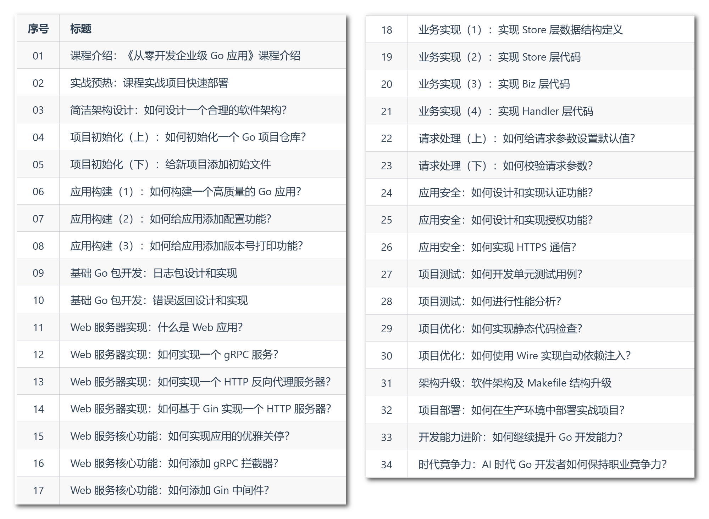

## miniblog 项目

- 更多「云原生 AI 实战营」项目见：[云原生 AI 实战营项目介绍](https://konglingfei.com/cloudai/intro/%E4%BA%91%E5%8E%9F%E7%94%9F_AI_%E5%AE%9E%E6%88%98%E8%90%A5%E9%A1%B9%E7%9B%AE%E4%BB%8B%E7%BB%8D.html)

**小而美的 Go 实战项目，入门但不简单。**

miniblog（微博客） 是一个 Go 语言入门项目，用来完成用户注册、博客创建等业务功能。miniblog 入门但不简单：

- **入门：** 适用于刚学习完 Go 基础语法，零项目开发经验的 Go 开发者；
- **不简单：** 本项目来自于一线企业的大型线上项目，项目本身是一个企业级的项目，学习完之后，完全可以用来作为企业级项目的开发脚手架。

miniblog 实现了以下 2 类功能：
- **用户管理：** 支持用户注册、用户登录、获取用户列表、获取用户详情、更新用户信息、修改用户密码等操作；
- **博客管理：** 支持创建博客、获取博客列表、获取博客详情、更新博客内容、删除博客等操作。

**本项目适合人群**

- 刚学习完 Go 基础语法，想快速学习，以参与公司 Go 语言开发工作的开发者；
- 掌握 Go 基础语法，零 Go 应用开发经验，想通过完整的实战，快速、系统的学习 Go 开发的开发者；
- 有意从事 Go 应用开发，但尚未入门或入门尚浅的开发者；
- 有过 Go 应用开发经验，但想了解某一部分开发方法的开发者。

## 配套学习课程

miniblog 项目配套的课程见：[Go 项目开发中级实战课](https://konglingfei.com/cloudai/catalog/intermediate.html)



## 功能特点

- 软件架构：采用简洁架构设计，确保项目结构清晰、易维护；
- 高频Go包：使用了Go项目开发中常用的包，如gorm、casbin、govalidator、jwt-go、gin、cobra、viper、pflag、zap、pprof、grpc、protobuf、uuid、grpc-gateway等；
- 目录结构：遵循project-layout 规范，采用标准化的目录结构；
- 认证与授权：实现了基于JWT的认证和基于Casbin的授权功能；
- 日志与错误处理：设计了独立的日志包和错误码管理机制；
- 构建与管理：使用高质量的Makefile对项目进行管理；
- 代码质量：通过golangci-lint工具对代码进行静态检查，确保代码质量；
- 测试覆盖：包含单元测试、性能测试、模糊测试和示例测试等多种测试案例；
- 丰富的Web功能：支持请求ID、优雅关停、中间件、跨域处理、异常恢复等功能；
- 多种服务器类型：实现了gRPC服务器、HTTP服务器和HTTP反向代理服务器；
- 多种数据交换格式：支持JSON和Protobuf数据格式的交换；
- 开发规范：遵循多种开发规范，包括代码规范、版本规范、接口规范、日志规范、错误规范以及提交规范等；
- API设计：接口设计遵循RESTful API规范，并提供OpenAPI 3.0和Swagger 2.0格式的API文档；
- 部署难度低：实战项目可以快速部署。

## 快速开始

要求 Go 版本 >= 1.23.4。安装命令如下：

```bash
$ git clone https://github.com/onexstack/miniblog.git # 克隆项目
$ cd miniblog
$ go work init . # 初始化 Go 工作区
$ go work use .
$ make build BINS=mb-apiserver # 编译源码
$ _output/platforms/linux/amd64/mb-apiserver
$ curl http://127.0.0.1:5555/healthz # 调用健康检查接口，测试是否安装成功（HTTPS协议）
{"timestamp":"2024-12-26 23:50:29"}
$ go run examples/client/health/main.go # 测试健康检查接口（gRPC协议）
$ go run examples/client/user/main.go # 测试用户相关接口（gRPC协议）
$ go run examples/client/post/main.go # 测试博客相关接口（gRPC协议）
```

mb-apiserver 支持内存数据库和 MySQL 数据库，默认使用内存数据库启动。如果你想切换为 MySQL 数据库请按以下方式准备一个 MySQL 数据库：
- 您可以根据 [安装和配置 MariaDB 数据库](./docs/devel/zh-CN/mysql.md) 文档中的指引，安装并初始化一个 `miniblog` 数据库；
- 如果您有自己的数据库，请使用 `configs/miniblog.sql` 中的 SQL 初始化 miniblog 依赖的数据库及表，并更新 `configs/mb-apiserver.yaml` 文件中 `mysql` 配置项中的 `host`、`username`、`password`、`database`。

并修改 configs/mb-apiserver.yaml 文件中的 `enable-memory-store` 为 `false`。

## Documentation

[用户手册](./docs/guide/zh-CN/README.md)、[开发手册](./docs/devel/zh-CN/README.md)

## Feedback

如果您有任何反馈，请通过 `colin404@foxmail.com` 与我联系。

## Contributing

欢迎你贡献代码和 Star !

## Contacts

- 关注公众号【[令飞编程](https://mp.weixin.qq.com/s/a8efr1hZ6bZHOqH3ITj9yA)】，干货不错过：
  - 回复【资料】获取全套 Go + 云原生学习资料；
  - 回复【好友】可以添加我的微信，免费一对一技术交流指导；
  - 回复【星球】加入 [孔令飞的云原生实战营](https://konglingfei.com)，带你进阶 Go+云原生高级开发工程师。

## License

[MIT](https://choosealicense.com/licenses/mit/)
